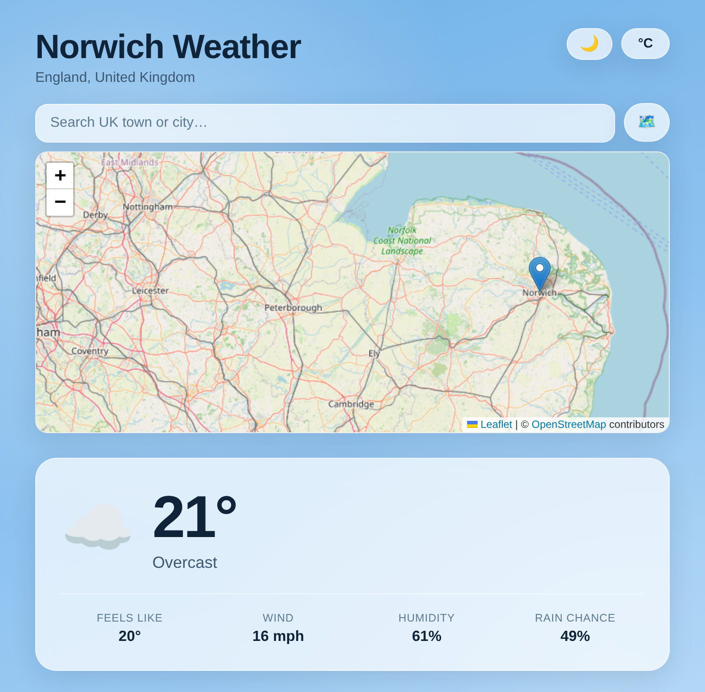

# Askmark Weather

**Live demo:** [GitHub Pages](https://askmark123.github.io/Askmark-/) · [Vercel](https://askmark-weather.vercel.app/)

A small static website showing live UK weather forecasts. Defaults to Norwich,
England, but you can search for any UK town or city.

- Search any UK town or city by name, pick a spot on an interactive map, or use your current location; remembers your last choice
- Current conditions, next 24 hours, and a 7-day outlook
- Data from [Open-Meteo](https://open-meteo.com/) (no API key required), fetched live in the browser
- Map powered by [Leaflet](https://leafletjs.com/) and [OpenStreetMap](https://www.openstreetmap.org/copyright) tiles; map clicks are reverse-geocoded via [Nominatim](https://nominatim.org/)
- Plain HTML/CSS/JS, no build step, works offline of the fetch itself
- Light/dark theme toggle (remembers your choice) and °C/°F toggle, auto-refreshes every 15 minutes

## Files

- `index.html` – page markup
- `style.css` – styling
- `script.js` – fetches the forecast and renders it

## Hosting

- **GitHub Pages** – a workflow at `.github/workflows/pages.yml` deploys this
  site automatically on every push to `main`. Requires repo
  **Settings → Pages → Build and deployment → Source** set to
  **GitHub Actions**.
- **Vercel** – connected directly to this repo via Vercel's Git integration;
  it also redeploys automatically on every push to `main`.

## Local preview

Just open `index.html` in a browser, or serve the folder with any static
file server, e.g. `python3 -m http.server`.

## Testing

`npm test` runs a dependency-free smoke test suite (Node's built-in test
runner) that checks the Open-Meteo/Nominatim API response shapes and
verifies every DOM id referenced in `script.js` exists in `index.html`.
Runs automatically on every push and pull request via
`.github/workflows/test.yml`.
